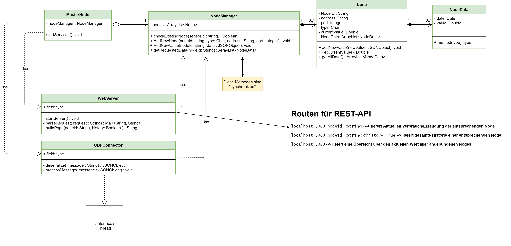
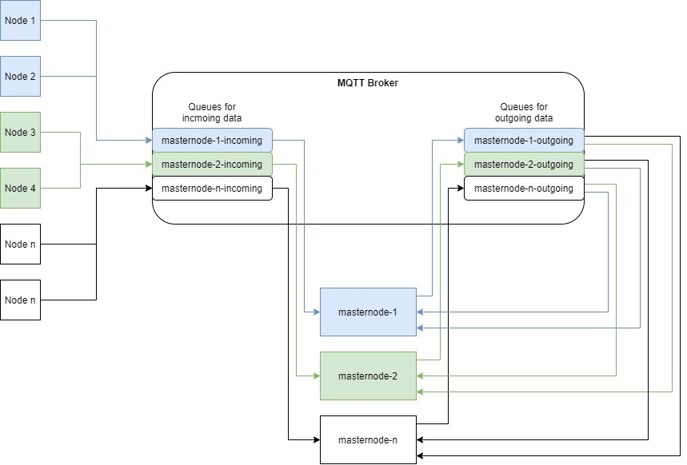

# Praktikum Verteilte Systeme

Document "Anforderungsanalyse" can be found here: https://docs.google.com/document/d/1FO7eDe20AQNggIx9FLcn10mOFHU6usgYtx0Ea0Cp7X0/edit?usp=sharing

GitLab-Issues have been created according to the document.

---

Table of Contents

[[_TOC_]]

---

# Setup
0) Optional: modify `docker-compose.yml`
1) run `docker-compose up`
2) container images will be created automatically and will be started afterwards
3) in your webbrowser visit `http://localhost:8080/` to access the masterNode webinterface

# REST API
## masterNode
The masterNodes Webinterface supports REST API calls. Add parameters to the base url to get specific data from a node in json format.

Parameters can be combined. The order of the parameters does not matter.

Following REST parameters are available for masterNode:
- `id`: The ID of the requested Node
- `history`: Boolean specifying if histroical data shall be returned
- `setRunning`: Boolean turning on/off a Node
- `setMinValue`: Integer to set the new minimum Value for a Node
- `setMaxValue`: Integer to set the new maximum Value for a Node

For e.g. the request `http://localhost:8080/?id=1&history=1` will return all historical data from the node with ID 1.

## externalClient
The masterNodes Webinterface supports REST API calls.

Following REST Operations are available for externalClient:

**Collect data from a MasterNode**

Parameters:
- `masternodeid`: ID of the targeted MasterNode
- `collectData`: Command to collect data from the masterNode containing information about all Nodes including their respective history. Has to be combined with a Integer value for the maxBlockSize specifying the size of the payload block size used in corresponding RPC-function-calls.

**Change Settings of a Node via RPC-Calls**

Parameters:
- `masternodeid`: ID of the targeted MasterNode
- `nodeid`: ID of the targeted Node, used for RPC-Calls to change Node-Settings
- `setRunning`: Boolean turning on/off a Node
- `setMinValue`: Integer to set the new minimum Value for a Node
- `setMaxValue`: Integer to set the new maximum Value for a Node


For e.g. the request `http://localhost:8080/?collectData=100` will return all Nodes with their historical data from the masterNode using a block size of 100 bytes for RPC-function-calls.

## Build docker images manually (optional)
- First navigate to subfolder of Node or MasterNode.
- run `docker build -t <tag> .`
  - for e.g. `docker build -t "node:0.0.1" .`
- start docker image with `docker run <image>`
  - for e.g. `docker run node:0.0.1`


# Classes
## MasterNode (Zentralsteuerung)

In order to start the MasterNode, the following **environment variables** must be set:

- MASTERNODEID (Integer)
- HEALTHCHECKTIMEOUT (Integer)
- NODERPCPORT (Integer)
- MASTERNODERPCPORT (Integer)
- CONNECTIONTYPE (String) ("UDP" or "MQTT")
- OTHERMASTERNODEIDS (List of Integers, separated by commas: ```,```)
  
When using `UDP` connection type:
- MASTERNODEPORT (Integer)

When using `MQTT` connection type:
- MQTTBROKERADDRESS (String)
- MQTTBROKERPORT (Integer)
- MQTTMSGTOPIC (String)

MasterNode will detect corrupt data packets and log them.

## NodeManager
Manages Node instances
- provides NodeEntities and corresponding data.
- checks health of node every 5 seconds and checks if the timout specified by `HEALTHCHECKTIMEOUT` has been exceeded.
- Status of a node is set accordingly and displayed in the webinterface.

## Nodes

In order to start a node, the following **environment variables** must be set:

- ID (Integer)
- TYPE (Character)
- NAME (String)


- VALUEMIN (Integer)
- VALUEMAX (Integer)
- MASTERNODEID (Integer)
- MASTERNODEPORT (Integer)
- RPCPORT (Integer)
- SENDRATE (Integer)
- CORRUPTDATARATE (Integer) (`0` when no corrupt data shall be sent)
- MQTTBROKERADDRESS (String)
- MQTTBROKERPORT (Integer)


- connectiontype (String) ("UDP" or "MQTT")

When using `UDP` connection type:
- MASTERNODEPORT (Integer)

When using `MQTT` connection type:
- MQTTBROKERADDRESS (String)
- MQTTBROKERPORT (Integer)
- MQTTMSGTOPIC (String)

# UML diagram for masterNode (Zentralsteuerung)



# Debugging
## Simulate UDP Server

For debbugging purposes you can use the following command to simulate a UDP-Server which accepts multiple UDP packets:

`nc -kluvw 1 localhost 13337`

# Tests
# AP2 (aufgabe 2)
- see https://code.fbi.h-da.de/istlskeil/vs_ss21_theflash/-/issues/5#note_166050

# Replication

In order to facilitate data replication, separate mqtt topics have been added.

Two topics exist for each MasterNode. One *incoming*-topic and one *outgoing*-topic.

Nodes associated with a MasterNode will send their data to the corresponding incoming topic.

So for e.g. if Node 1 is associated with MasterNode 1, it will send its data to the *masternode-1-incoming* topic.
MasterNode 1 will then collect data from its incoming topic and manage it in its NodeManager instance. 
MasterNode 1 will then publish this data to its outgoing topic *masternode-1-outgoing* afterwards, to keep sequential consistency.

In order to achieve replication, each MasterNode can then collect data from other MasterNode's *outgoing*-topics.
So in our example, MasterNode 2 can subscribe to the *masternode-1-outgoing* topic to be able to collect data from MasterNode 1.
With this architecture, each MasterNode can subscribe to the *outgoing*-topic of the other MasterNodes in order to replicate their data.
This essentially implements a master/slave-architecture.



